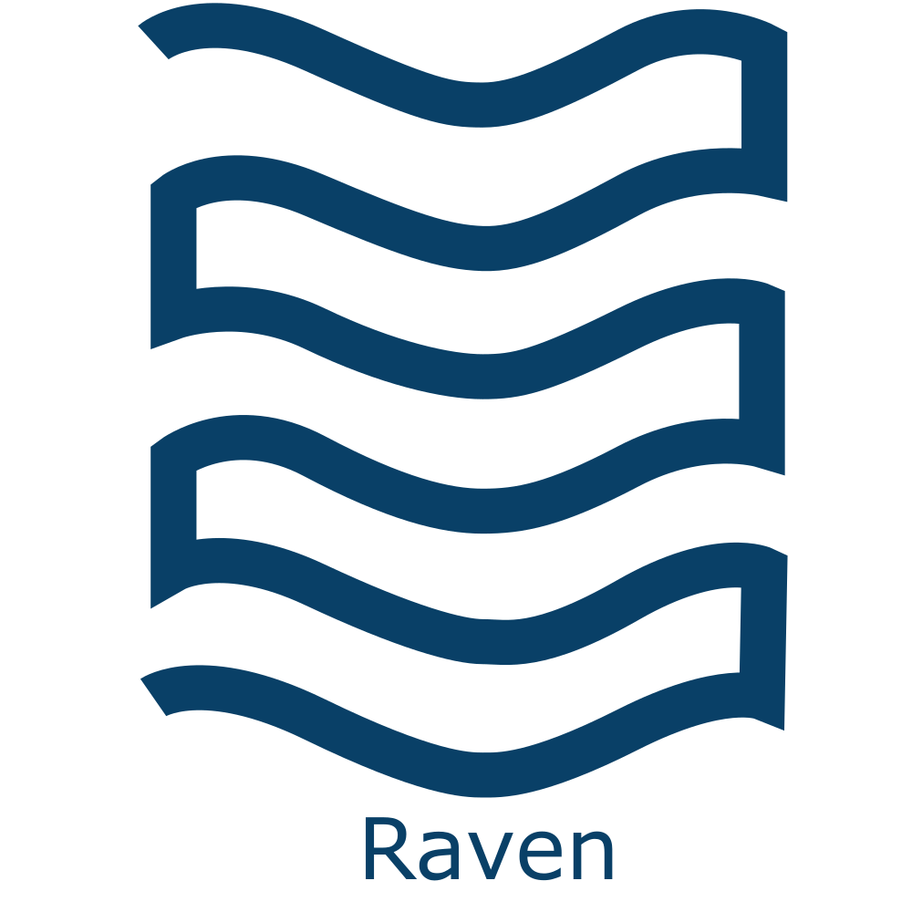

<h1 align="center">Raven</h1>
<h2 align="center">Submission for Rapyd Fintech Grand Prix Hackathon 2021</h2>

  

The modern lifestyle is all about doing more with less. Raven is an Android app made just for that. Chat with friends, lend and borrow money from those you trust, find places to visit and share cab rides with friends, all in one single app.

## 🧧 Rapyd Ewallet

With the help of Rapyd's Wallet APIs, we are able to create a unique ewallet for our users which seamlessly integrates with other features of our app. You can use this ewallet to send/receive payments from your friends, raise funds if you are in need of money urgently and moreover, use it with 3rd-party apps like Uber, Zomato and pay its bills directly from within our app.

## 💳 Wallet Funding

We are using Rapyd's Collect API so that you can use your bank accounts and credit/debit cards as well as other local ewallets such as PayTM, Venmo, etc. to add funds to your Rapyd ewallet. We have also used Rapyd Collect's Customer API which helps us store your preferred way of adding funds to your wallet to save those extra seconds for typing in your card details. Pretty sweet, right?

## 💸 Money Transfer

Again, for transferring money from one ewallet to another ewallet, we are taking help of Rapyd's Wallet APIs as well as Rapyd's Disburse API if you want to pay someone who's not using Rapyd Ewallet.
